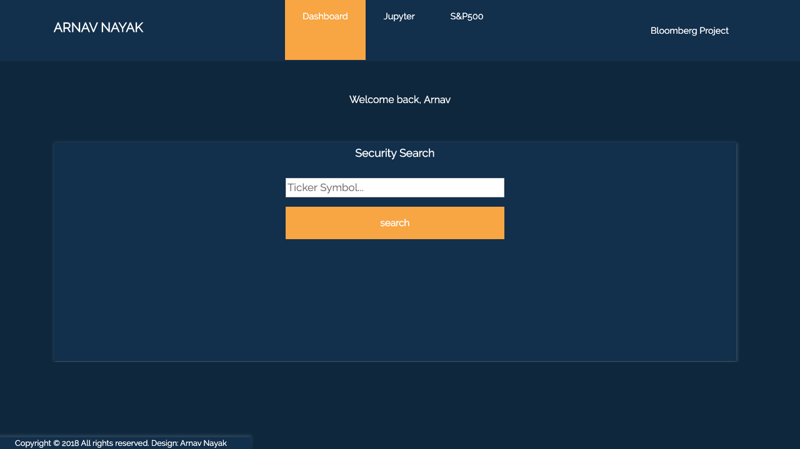
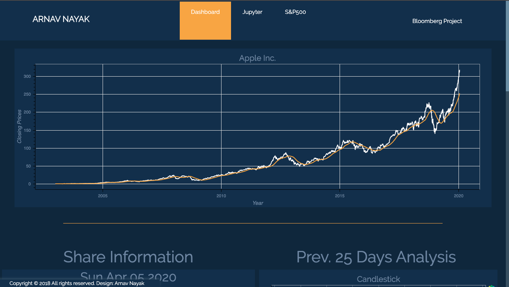
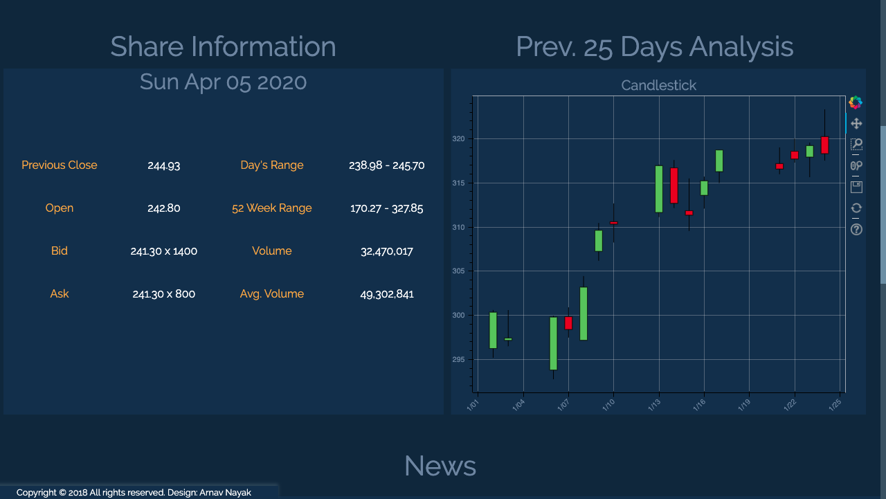
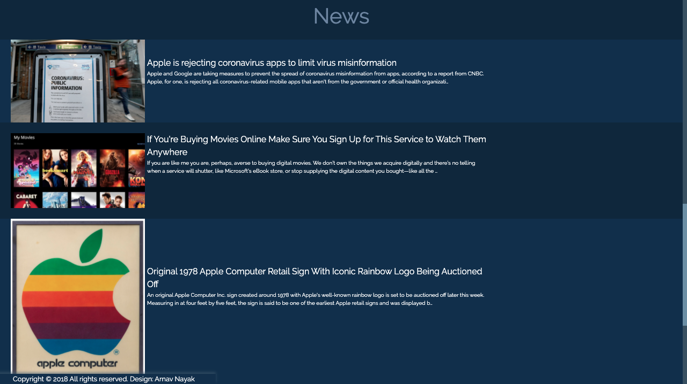
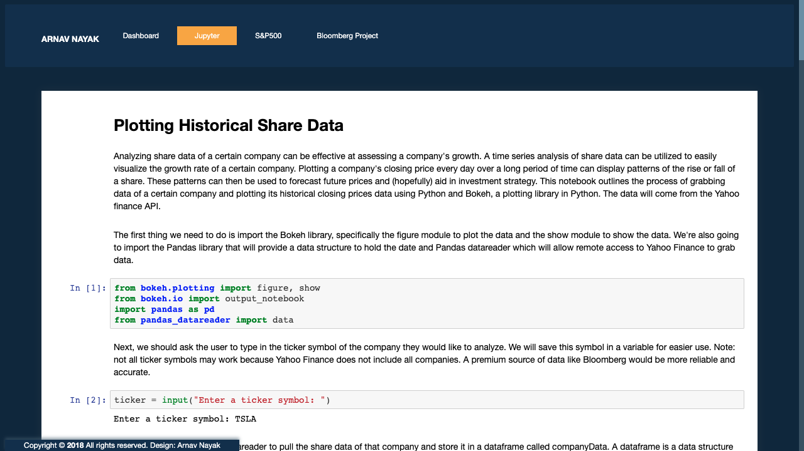
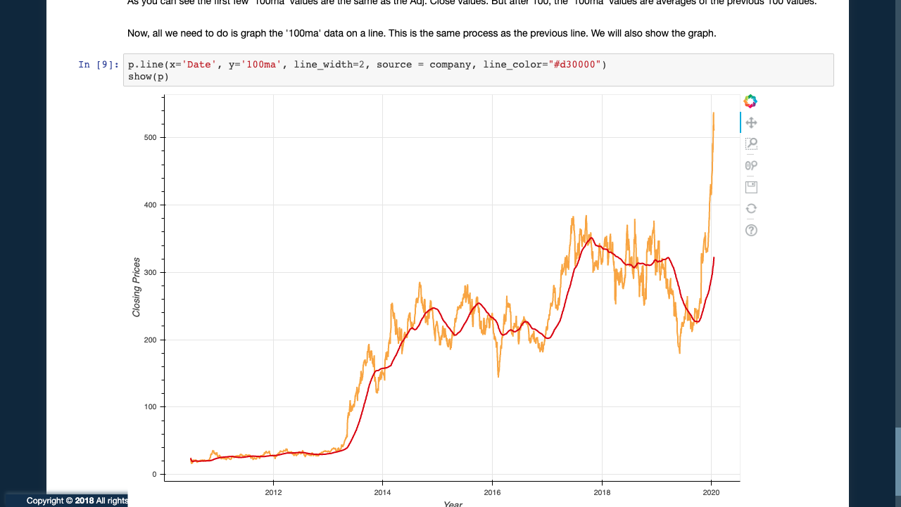
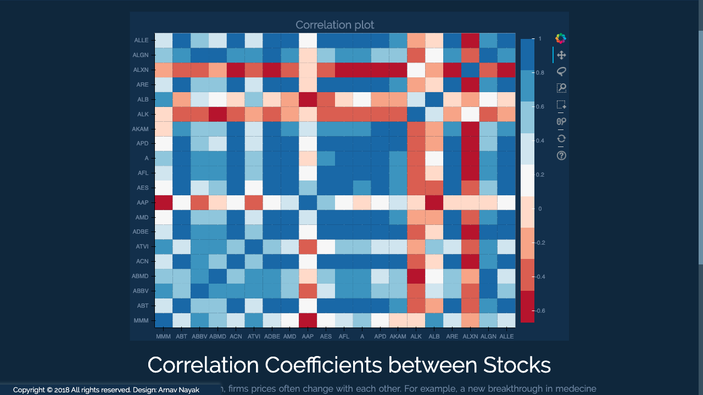

# Bloomberg Data Visualization Project

## Summary 😄
In my junior year, the Bloomberg Data center by Princeton was offering some students opportunities to create a project that involves Python and data visualization, preferably financial data. Going along with this format, I made a web application with Flask that allows users to type in the ticker symbol of any company they like, and see a time series analysis of the company's share prices. The web app also uses web scraping to grab data from the Yahoo finance page for tables and a candlestick chart that shows open, low, high and close prices. Along with the news of that particular company, there is also a Jupyter notebook file, outlining the code used to grab and create the visuals. The visuals were made using Bokeh plots.

On the last tab, there is a correlation coefficient graph with the top 25 S&P500 companies. Being such a volatile market, finding correlation between the price movements of two companies is important to minimize risk in a portfolio, or doubling down on risk for a greater return. 

## Home Page 📷

## Dashboard (Apple is used as an example) 📷

## Jupyter Page 📷

## Correlation Chart 📷

## Tech 💻
* [Flask](https://flask.palletsprojects.com/en/1.1.x/) - The web framework used
* [Bokeh](https://docs.bokeh.org/en/latest/index.html) - The Visualization API
* [BeautifulSoup](https://www.crummy.com/software/BeautifulSoup/bs4/doc/) - Web scraping API 
* [Pandas](https://pandas.pydata.org/) - The Data manipulation API
* [Jupyter Notebook](https://jupyter.org/) - Used to easily present the code
